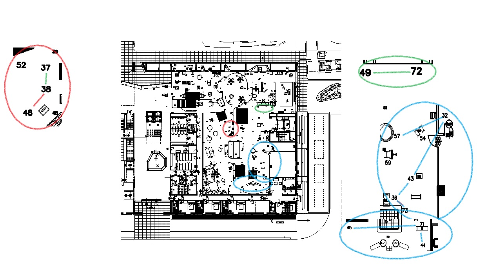
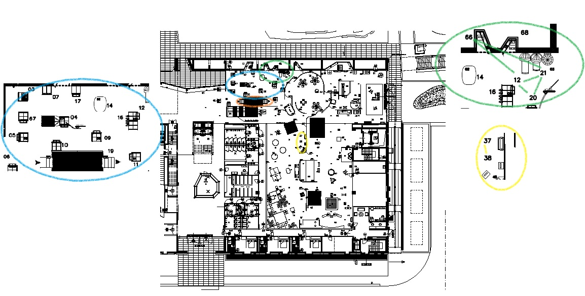

Raport jest efektem pracy zespo³owej. Wk³ad pracy poszczególnych cz³onków zespo³u w trzeciej fazie projektu:

* Kondrad Czechowski: 
    implementacja w R regu³ asocjacyjnych oraz analizy g³ównych sk³adowych

* Karolina Gajewska:
    zebranie dotychczasowych kodów w jeden plik rmd, opis s³owo-graficzny otrzymanych wyników

* Iwona Majewska:
    implementacja w R metod klastrowania oraz opis wyników klastrowania


# Wprowadzenie

<justify> Wyniki niniejszego raportu opieraj± siê na danych zebranych w okresie: 01.01.2012 - 31.05.2012 dotycz±cych 54 eksponatów z wystawy `Re:generacja` w Centrum Nauki Kopernik. G³owny cel trzeciej fazy projektu stanowi opisanie zale¿no¶ci wystêpuj±cych pomiêdzy eksponatami i próba scharakteryzowania osób wchodz±cych z nimi w interakcje. Zastosowane metody, g³ownie: `analiza czynnikowa`, `regu³y asocjacyjne` oraz `analiza g³ównych sk³adowyh z rotacj± czynników` pozwoli³y wyodrêbniæ nowe kategorie opisuj±ce zwiedzaj±cych. Otrzymane rezultaty porównano z modyfikacj± metod zastosowanych w fazie drugiej projektu. Co ciekawe, zarówno nowe podej¶cie do tematu, jak równie¿ modyfikacja poprzedniego, tj `klastrowania` pozwoli³a na wysuniêcie nastêpuj±cego wniosku, i¿ kluczowy wp³yw na liczbê zachodz±cych z eksponatem interakcji ma jego po³o¿enie. Zwiedzaj±cy "bawi± siê"
najczê¶ciej stacjami usytuwanymi blisko siebie. Stacje po³o¿one w mniej widocznym miejscu ciesz± siê mniejsz± popularno¶ci±. 

###Stosowane pakiety
Wszystkie obliczenia zosta³y przeprowadzone w ¶rodowisku `GNU R` przy u¿yciu nastêpuj±cych pakietów: 

```{r, message=FALSE, warning=FALSE}
library(arules)
library(arulesViz)
library(tidyr)
library(ggplot2)
library(MASS)
library(cluster)
library(factoextra)
```

### Cele i pytania badawcze

Omawiane metody zadaj± grupowanie stacji, znacz±co pokrywaj±ce siê z podzia³em stacji na obszary: `JA`, `JA-TY`, `JA-MY-ONI`, `JA-¦WIAT`. Dla przypomnienia poni¿ej podajemy podajemy podzia³ omawianych eksponatów ze wzglêdu na przynale¿no¶æ do sfery omawianej wystawy:

```{r, message=FALSE, warning=FALSE}
ja <- c("cnk02a", "cnk02b", "cnk03", "cnk05", "cnk06", "cnk07", "cnk09", "cnk10",
        "cnk11", "cnk13", "cnk16", "cnk17", "cnk19a", "cnk19b", "cnk20", "cnk21",
        "cnk66", "cnk67")

ja.my.oni <- c("cnk100", "cnk12", "cnk32", "cnk39", "cnk40", "cnk42a", "cnk43",
               "cnk44", "cnk45", "cnk49", "cnk55", "cnk56", "cnk57", "cnk58b", 
               "cnk60", "cnk61", "cnk62", "cnk69", "cnk71", "cnk72", "cnk73",
               "cnk79")

ja.ty <- c("cnk18", "cnk22", "cnk25", "cnk26", "cnk29a", "cnk78a")

ja.swiat <- c("cnk37", "cnk38", "cnk46a", "cnk46b", "cnk48a", "cnk75")

stacje <- c(ja, ja.my.oni, ja.ty, ja.swiat, "cnk63a", "cnk36")

```

G³ownym przedmiotem zainteresowania w trzeciej fazie omawianego projektu by³y wspó³zale¿no¶ci pomiêdzy odwiedzanymi eksponatami. Celem by³o znalezienie odpowiedzi na pytania: 

- Które stacje odwiedzane s± najczê¶ciej razem?

- Które interakcje siê wykluczaj± a które wspieraj±?

- Jakie jest prawdopodobieñstwo, ¿e zwiedzaj±cy, który wszed³ w interakcjê z eksponatem A, wejdzie w interakcjê równie¿ z maszyn± B?


##Przygotowanie danych
Wykorzystuj±c efekty przetwarzania danych uzyskane w poprzednich fazach projektu na potrzeby trzeciej fazy przygotowano transakcyjn± macierz binarn± z której mo¿na wyczytaæ z którymi eksponatami dany odwiedzaj±cy wszed³ w interakcjê.

```{r, message=FALSE, warning=FALSE}
#za³adowanie ramki danych z poprzednich faz projektu
load('czasyszerokie.Rda')
st <- stations.wide

#binarna ramka danych
st.bin <- st
st.bin[is.na(st)] <- 0
st.bin[st.bin > 0] <- 1

#odrzucamy kolumny z samymi zerami odpowiadaj±ce stacjom, które nie zosta³y odwiedzone
non.zero.stations <- colnames(st.bin)[colSums(st.bin) >0]
st.bin <- st.bin[,non.zero.stations]

#sortujemy kolumny wed³ug kolejno¶ci z wektora `stacje`
st.bin <- st.bin[,stacje]
trans.bin <- as(as(st.bin, 'matrix'), 'transactions')
```

#Regu³y asocjacyjne / regu³y skojarzeniowe 

##Przyk³ad 1
Na pocz±tku analizy z wykorzystaniem regu³ asocjacyjnych ustalmy, i¿ rozpatrujemy jedynie te regu³y, dla których wsparcie przekracza 0.005, za¶ miara zaufania  0.05. 

```{r, message=FALSE, echo= FALSE, warning=FALSE, include=FALSE}
results.bin <- apriori(trans.bin, parameter = list(support=0.005, target='rules',
                                                   confidence = 0.05,
                                                   maxlen = 2))
```

```{r, message=FALSE, echo= FALSE, warning=FALSE}
results.bin
```

Otrzymali¶my 2826 regu³. Dla przyk³adu omówmy te o najwiêkszej i najmniejszej warto¶ci miary podniesienia. 
```{r, message=FALSE, echo= FALSE, warning=FALSE}
inspect(head(sort(results.bin , by = "lift"), 5))
inspect(tail(sort(results.bin , by = "lift"), 5))
```
Na podstawie powy¿szego stwierdziæ mo¿emy i¿ zwiedzaj±cy najszczê¶ciej wchodzi w interakcje ze stacjami po³o¿onymi blisko siebie, za¶ rzadko wchodzi w interkacje ze stacjami miêdzy którymi wyst±puje du¿y dystans. Stacja CNK25 - `Rodzinny interes` usytuowana jest w "k±ciku"", gdzie mo¿na w spokoju obejrzeæ scenki z ¿ycia ró¿nych rodzin na ¶wiecie. Jest zatem odizolowana od innych stacji. Na podstawie uzyskanych rezultatów wnioskowaæ te¿ mo¿emy, ¿e je¶li dosz³o do interkacji z eksponatem CNK25, wówczas na ogó³ nie dochodzi³o do interkacji z innymi eksponatami, w szczególno¶ci z eksponatem CNK11, CNK02, CNK19.

<center>


```{r, message=FALSE, echo= FALSE, warning=FALSE}
res.sub <- subset(results.bin, subset=lift >2.9)
res.sub
plot(res.sub, method='graph')
```



</center>

### Wnioski
Na podstawie powyszej analizy dostrzegamy powiazania stacji ze strefy ja-my-oni, powiazane s± te stacje, które  znajduj± siê blisko siebie.

##Przyk³ad 2

W kolejnym kroku analizy na³o¿ono mniej liberalne kryteria. Dla miary wsparcia równej 0.02 oraz miary zaufania równej 0.35 i liftu < 2.3 otrzymano 30 regu³.

```{r, message=FALSE, echo= FALSE, warning=FALSE}
results.bin2 <- 
  apriori(trans.bin,
          parameter = list(support=0.02, target='rules', confidence = 0.35, maxlen = 2))
res.sub <- subset(results.bin2, subset=lift >2.3)
res.sub
plot(res.sub, method='graph')
```




### Wnioski: 
Powy¿szy przyk³ad potwierdzi³ wnioski przytoczone w poprzednim przyk³adzie, ¿e powiazane s± w wiekszosci stacje usytuowane blisko siebie.

# Analiza g³ownych sk³adowych

```{r, message=FALSE, echo= FALSE, warning=FALSE}

#funkcja pomocnicza
print.high <- function(m, tresh, ...){
  m2 <- m
  m2[abs(m) < tresh] <- 0
  print.table(m2, ...)
}
```

```{r, message=FALSE, warning=FALSE}
#PCA bez rotacji
bin.pca.sc <- prcomp(st.bin[1:100000,], scale. = TRUE)
```

<center>
```{r, message=FALSE, echo= FALSE, warning=FALSE}
#plot(bin.pca.sc, type = 'l')
#print.high(bin.pca.sc$rotation[,1:4], 0.1, digits=3, zero.print ='')
#print(round(bin.pca.sc$rotation[,1:3], 3))
Variance<- (bin.pca.sc$sdev)^2
s<-sum(Variance)
h<-Variance/s

#ramka danych do wykresu
df2<-data.frame(x=Variance,y=h, z=1:54)
library(ggrepel)

ggplot(df2[1:10,], aes(x=z, y=x)) +
     geom_point() +
     scale_x_continuous("Numer wart. w³asnej", breaks=1:10) +
     geom_text_repel(label=round(df2[1:10,]$y,3)) +
     ylab("Warto¶æ w³asna") +
     ggtitle("Wykres osypiska")+
     geom_line()
```
</center>
Redukcji wymiaru dokonujemy na podstawie kryterium graficznego, opartego na wykresie osypiska. Widzimy, ¿e na prawo od punktu odpowiadaj±cemu trzeciej warto¶ci w³asnej wystêpuje ³agodny spadek warto¶ci w³asnych. Dlatego te¿ w dalszej analizie uwzglêdnimy jedynie trzy czynniki. Niestety, w naszym przypadku nie zosta³o zachowane kryterium proporcji. Na podstawie wykresu  mo¿na
odczytaæ, i¿ pierwsza sk³adowa wyja¶nia nieca³e 12% ca³kowitej zmienno¶ci.
Druga sk³adowa wyja¶nia 5%, a trzecia 3%, co daje ³±cznie oko³o 20%
ca³kowitej zmienno¶ci. 

```{r, message=FALSE, echo=FALSE, warning=FALSE, include=FALSE}
#PCA bez rotacji
#print(round(bin.pca.sc$rotation[,1:3], 3))
dt2<- as.data.frame(print(round(bin.pca.sc$rotation[,1:3], 3)))

dt2$strefa<-0
dt2[ja,4] <- "ja"
dt2[ja.swiat,4] <-"ja.swiat"
dt2[ja.ty,4] <- "ja.ty"
dt2[ja.my.oni,4] <- "ja.my.oni"
dt2
```


| Eksponat |PC1 | PC2   | PC3  | strefa |
| -------|:----:| -----:|-----:|-----:|
| cnk02a | 0.098| -0.128 | 0.004       | ja|
| cnk02b | 0.087| -0.095 | 0.105       | ja|
| cnk03  | 0.144| -0.162| -0.054       | ja|
| cnk05  | 0.168| -0.178| -0.042       | ja|
| cnk06  | 0.122| -0.129 | 0.153       | ja|
| cnk07  | 0.170| -0.195| -0.066       | ja|
| cnk09  | 0.175| -0.179| -0.106       | ja|
| cnk10  | 0.165| -0.181| -0.090       | ja|
| cnk11  | 0.142| -0.150 | 0.031       | ja|
| cnk13  | 0.120| -0.121 | 0.018       | ja|
| cnk16  | 0.178| -0.200| -0.008       | ja|
| cnk17  | 0.156| -0.192| -0.075       | ja|
| cnk19a | 0.033| -0.141 | 0.643       | ja|
| cnk19b | 0.076| -0.137 | 0.610       | ja|
| cnk20  | 0.166| -0.166| -0.096       | ja|
| cnk21  | 0.165| -0.165| -0.101       | ja|
| cnk66  | 0.182| -0.170| -0.074       | ja|
| cnk67  | 0.147| -0.170| -0.068       | ja|
| cnk100 | 0.080| -0.055 | 0.090| ja.my.oni|
| cnk12  | 0.192| -0.180| -0.107| ja.my.oni|
| cnk32  | 0.156 | 0.183 | 0.034| ja.my.oni|
| cnk39  | 0.141 | 0.087 | 0.021| ja.my.oni|
| cnk40  | 0.130 | 0.126| -0.007| ja.my.oni|
| cnk42a | 0.108 | 0.151 | 0.072| ja.my.oni|
| cnk43  | 0.153 | 0.183 | 0.022| ja.my.oni|
| cnk44  | 0.140 | 0.168 | 0.040| ja.my.oni|
| cnk45  | 0.143 | 0.161 | 0.023| ja.my.oni|
| cnk49  | 0.150 | 0.098| -0.059| ja.my.oni|
| cnk55  | 0.149 | 0.155 | 0.013| ja.my.oni|
| cnk56  | 0.085 | 0.099 | 0.054| ja.my.oni|
| cnk57  | 0.145 | 0.152 | 0.019| ja.my.oni|
| cnk58b | 0.121 | 0.121 | 0.026| ja.my.oni|
| cnk60  | 0.119 | 0.043| -0.020| ja.my.oni|
| cnk61  | 0.127 | 0.044 | 0.009| ja.my.oni|
| cnk62  | 0.111 | 0.003 | 0.001| ja.my.oni|
| cnk69  | 0.166 | 0.133| -0.027| ja.my.oni|
| cnk71  | 0.144 | 0.180 | 0.043| ja.my.oni|
| cnk72  | 0.167 | 0.090| -0.049| ja.my.oni|
| cnk73  | 0.112 | 0.174 | 0.072| ja.my.oni|
| cnk79  | 0.172 | 0.123| -0.030| ja.my.oni|
| cnk18  | 0.151| -0.062| -0.042    | ja.ty|
| cnk22  | 0.064 | 0.044| -0.040    | ja.ty|
| cnk25 | -0.006 | 0.137| -0.187    | ja.ty|
| cnk26  | 0.129 | 0.036| -0.079    | ja.ty|
| cnk29a | 0.024 | 0.030| -0.055    | ja.ty|
| cnk78a | 0.175| -0.040| -0.038    | ja.ty|
| cnk37  | 0.144 | 0.093 | 0.013 | ja.swiat|
| cnk38  | 0.119 | 0.095 | 0.032 | ja.swiat|
| cnk46a | 0.103 | 0.111 | 0.066 | ja.swiat|
| cnk46b | 0.129 | 0.117 | 0.076 | ja.swiat|
| cnk48a | 0.116 | 0.099 | 0.033 | ja.swiat|
| cnk75  | 0.124 | 0.138 | 0.040 | ja.swiat|
| cnk63a | 0.122 | 0.087 | 0.012        | NA|
| cnk36  | 0.129 | 0.178 | 0.055         |NA|


£adunki czynnikowe traktuje siê jako korelacje miêdzy zmiennymi a sk³adowymi.
Zauwa¿amy, ¿e jedyn± stacj± ujemnie skolerowan± z pierwsz± sk³adow± jest stacja CNK25 omawiana w poprzednich podpunktach niemniejszej pracy. Potwierdza to s³uszno¶æ wysuniêtych wcze¶niej wniosków, ¿e osoby, które wesz³y w interkacjê ze stajc± CNK25 rzadziej odwiedzaj± inne stacje. Co wiêcej ³adunki czynnikowe w ka¿dej z analizowanych sk³adowych maj± zbli¿one warto¶ci dla stacji znajduj±cych siê blisko siebie, b±d¼ pochodz±cych z tej samej sfery tematycznej.

## Analiza g³ownych sk³adowych czynniki rotacyjne


```{r, message=FALSE, echo= FALSE, warning=FALSE, include=FALSE}
eig.vals <- bin.pca.sc$sdev
scaled.loadings <- bin.pca.sc$rotation %*% diag(eig.vals)
bin.rot.sc <- varimax(scaled.loadings[,1:4])
dt3<-print.high(bin.rot.sc$loadings, 0.2, digits=3, zero.print ='')
```

Kolejn± zastosowan± metod± jest analiza sk³adowych g³ównych z czynnikami rotacyjnymi. Poni¿sza tabela przedstawia wyniki analizy. W celu poprawienia czytelno¶ci tabeli, puste miejsca reprezentuj± warto¶ci o warto¶ci bezwzglêdnej < 0.2.

<center>
| Eksponat |PC1 | PC2   | PC3  | PC4 | strefa |
| -------|:----:| -----:|-----:|-----:|------:|
|cnk02a  | 0.316|       |      |      |   ja  |                 
|cnk02b  |0.234 |       |      |      |ja     |                    
|cnk03   |0.449 |       |      |      |ja     |                    
|cnk05   |0.503 |       |      |      |ja     |            
|cnk06   |0.307 |       | 0.264|      |     ja|       
|cnk07   |0.535 |       |      |      |ja     |
|cnk09   |0.533 |       |      |      |ja     |
|cnk10   |0.520 |       |      |      |ja     |
|cnk11   |0.397 |       |      |      |ja     |
|cnk13   |0.331 |       |      |      |ja     |
|cnk16   |0.524 |       |      |      |ja     |
|cnk17   |0.502 |       |      |      |ja     |
|cnk19a  |      |       |0.872 |      |ja     |
|cnk19b  |      |       |0.841 |      |ja     |
|cnk20   |0.492 |       |      |      |   ja  |                   
|cnk21   |0.493 |       |      |      |   ja  |                    
|cnk66   |0.519 |       |      |      |   ja  | 
|cnk67   |0.467 |       |      |      |   ja  | 
|cnk100  |      |       |      |      |   ja  |                           
|cnk12   |0.555 |       |      |      |ja.my.oni|                    
|cnk32   |      |0.456  |      |      |ja.my.oni|
|cnk39   |      |       |      |0.427 |ja.my.oni|
|cnk40   |      | 0.263 |      |0.288 |ja.my.oni|
|cnk42a  |      | 0.365 |      |      |ja.my.oni|            
|cnk43   |      | 0.484 |      |      |ja.my.oni|  
|cnk44   |      | 0.458 |      |      |ja.my.oni|            
|cnk45   |      | 0.445 |      |      |ja.my.oni|             
|cnk49   |      |       |      |0.458 |ja.my.oni|  
|cnk55   |      | 0.348 |      |0.279 |ja.my.oni|  
|cnk56   |      |       |      |      |ja.my.oni|                            
|cnk57   |      | 0.387 |      |      |ja.my.oni|           
|cnk58b  |      | 0.223 |      |0.316 |ja.my.oni| 
|cnk60   |      |       |      |0.389 |ja.my.oni| 
|cnk61   |      |       |      |0.427 |ja.my.oni| 
|cnk62   |      |       |      |0.402 |ja.my.oni|  
|cnk69   |      | 0.232 |      |0.475 |ja.my.oni| 
|cnk71   |      | 0.469 |      |      |ja.my.oni| 
|cnk72   |      |       |      |0.485 |ja.my.oni| 
|cnk73   |      | 0.437 |      |      |ja.my.oni| 
|cnk79   |      | 0.230 |      | 0.475|ja.my.oni|
|cnk18   |0.305 |       |      | 0.278|ja.ty|
|cnk22   |      |       |      | 0.320|ja.ty|
|cnk25   |      |       |-0.259| 0.219|ja.ty|
|cnk26   |      |       |      | 0.401|ja.ty|
|cnk29a  |      |       |      | 0.227|ja.ty|
|cnk78a  |0.308 |       |      | 0.363|ja.ty|
|cnk37   |      |0.452  |      |      |ja.swiat|
|cnk38   |      |0.428  |      |      |ja.swiat|
|cnk46a  |      |0.362  |      |      |ja.swiat|
|cnk46b  |      |0.412  |      |      |ja.swiat|
|cnk48a  |      |0.408  |      |      |ja.swiat|
|cnk75   |      |0.396  |      |      |ja.swiat|
cnk63a   |      |0.347  |      |      |NA|
cnk36    |      |0.453  |      |      |NA|

</center>

```{r, message=FALSE, echo= FALSE, warning=FALSE}
highest <- apply(abs(bin.rot.sc$loadings), 1, which.max)

groups <- tapply(rownames(bin.rot.sc$loadings), highest, identity)
stations.ordered <- unlist(groups)

```

Wyniki analizy sk³adowych g³ownych utrzymuj± nas w przekonaniu, i¿ dobrym pomys³em jest aby grupowaæ stacje ze wzglêdu na ich po³o¿enie oraz przynale¿no¶æ do strefy. S³uszno¶æ zaproponowanego podzia³u potwierdza poni¿szy wykres:

```{r, message=FALSE, echo= FALSE, warning=FALSE}
ro <- sample.int(100000, 10000)

stat.ord <- stations.ordered # from pca_wth_rotation
names(stat.ord) <- NULL

supp <- function(s) sum(s) / length(s)
lift <- function(s1, s2) supp(s1 & s2) / (supp(s1) * supp(s2))
lift.wrapp <- function(stacja1, stacja2) lift(st.bin[ro,stacja1], st.bin[ro,stacja2])
stations.lift <- outer(stat.ord, stat.ord, Vectorize(lift.wrapp))
st.lif <- as.data.frame(stations.lift)
colnames(st.lif) <- stat.ord
rownames(st.lif) <- stat.ord
st.lif$st1 <- stat.ord
lift.thin <- gather_(st.lif, "st2", "lift", stat.ord)

lift.no.diag <- lift.thin[lift.thin$st1 != lift.thin$st2,]
lift.no.diag$st1 <- factor(lift.no.diag$st1, levels = stat.ord)
lift.no.diag$st2 <- factor(lift.no.diag$st2, levels = stat.ord)

#jet.colors <- colorRampPalette(c("#00007F", "blue", "#007FFF", "cyan", "#7FFF7F", "yellow", "#FF7F00", "red", "#7F0000"))

#colors <- colorRampPalette(c('white','blue',"black"))(3)
#wykres liftu, kolejne czynniki otrzymane ze zrotowanego pca
colour_mapping <- scale_fill_gradientn(colours = c('red','white','blue'), values=c(0, 0.15, 1))

ggplot(lift.no.diag, aes(x=st1, y=st2, fill=lift)) + 
  geom_tile()+ theme(axis.text.y=element_text(size=5), axis.text.x = element_text(angle = 90,size =5, hjust = 0.1)) + colour_mapping +
  ggtitle("Mapa kolorów obrazuj±ca warto¶ci korelacji miêdzy stacjami")
```

#Klastrowanie 
##Klastrowanie i rzutowanie stacji

Analiza czynnikowa w naturalny sposób wygenerowa³a podzia³ eksponatów na grupy. Inn± metod± grupowania eksponatów jest wykorzystanie algorytmów klastruj±cych. 
Do obliczeñ wykorzystali¶my poprzednio przygotowan± macierz binarn±. Odleg³o¶ci miêdzy eksponatami obliczyli¶my korzystaj±c z funkcji `daisy{cluster}`.Otrzyman± macierz odleg³o¶ci wykorzystali¶my do podzia³u eksponatów na 4 klastry przy pomocy funkcji `pam{cluster}`. Poni¿sza tabela prezentuje wyniki klastrowania.


```{r, echo=FALSE, message=FALSE}
load("czasyszerokie.Rda")
set.seed(181)
n <- 20000
ix <- sample.int(154287, n)
stations.wide <- stations.wide[ix, ]
stations.wide[is.na(stations.wide)] <- 0

ja <- c("cnk02a", "cnk02b", "cnk03", "cnk05", "cnk06", "cnk07", "cnk09", "cnk10", 
        "cnk11", "cnk13", "cnk16", "cnk17", "cnk19a", "cnk19b", "cnk20", "cnk21", 
        "cnk66", "cnk67")
ja.my.oni <- c("cnk100", "cnk12", "cnk32", "cnk39", "cnk40", "cnk42a", "cnk43", "cnk44", 
               "cnk45", "cnk49", "cnk55", "cnk56", "cnk57", "cnk58b", "cnk60", "cnk61", 
               "cnk62", "cnk69", "cnk71", "cnk72", "cnk73", "cnk79")
ja.ty <- c("cnk18", "cnk22", "cnk25", "cnk26", "cnk29a", "cnk78a")
ja.swiat <- c("cnk37", "cnk38", "cnk46a", "cnk46b", "cnk48a", "cnk75")

stacje <- c(ja, ja.my.oni, ja.ty, ja.swiat, "cnk63a", "cnk36")

stations.bin <- as.data.frame(stations.wide>0)
freq <- apply(stations.bin, 2, sum)

freq.v <- apply(stations.bin, 1, sum)
stations.bin <- stations.bin[, freq>0]
stations.bin <- stations.bin[freq.v>0, ]


stations.bin.t <- as.data.frame(t(stations.bin))
```

 

```{r, echo=FALSE}
#diss.visitors <- daisy(stations.bin)

diss.stations <- daisy(stations.bin.t, type = list(asymm=1:ncol(stations.bin.t)))
diss.stations.m <- as.data.frame(as.matrix(diss.stations))


for(i in 1:54) {diss.stations.m[i, i] <- NA}
diss.stations.m$st1 <- rownames(diss.stations.m)

diss.stations.m2 <- gather_(diss.stations.m, "st2", "dis", colnames(diss.stations.m)[1:54])


#ggplot(diss.stations.m2, aes(x=st1, y=st2, fill=dis)) + geom_tile() +theme(axis.text.x = element_text(angle = 90, hjust = 1))

```


```{r, echo=FALSE}

clust.stacje <- pam(diss.stations, k=4)

grupy.stacji <- as.data.frame(clust.stacje$clustering)
colnames(grupy.stacji) <- c("klaster")
grupy.stacji$eksponat <- rownames(grupy.stacji)
grupy.stacji$obszar <- ifelse(grupy.stacji$eksponat %in% ja, "JA", ifelse(grupy.stacji$eksponat %in% ja.ty, "JA-TY", ifelse(grupy.stacji$eksponat %in% ja.my.oni, "JA-MY-ONI", ifelse(grupy.stacji$eksponat %in% ja.swiat, "JA-¦WIAT", "nieznany"))))

grupy.stacji <- grupy.stacji[order(grupy.stacji$klaster, grupy.stacji$eksponat),]

#grupy.stacji[,c(1,3)]
```
| Eksponat |klaster | strefa |
| -------|:----:|------:|
| cnk02a      | 1       | JA
| cnk03       | 1       | JA
| cnk05       | 1       | JA
| cnk07       | 1       | JA
| cnk09       | 1       | JA
| cnk10       | 1       | JA
| cnk100      | 1| JA-MY-ONI
| cnk11       | 1       | JA
| cnk12       | 1| JA-MY-ONI
| cnk13       | 1       | JA
| cnk16       | 1       | JA
| cnk17       | 1       | JA
| cnk18       | 1    | JA-TY
| cnk20       | 1       | JA
| cnk21       | 1       | JA
| cnk62       | 1| JA-MY-ONI
| cnk66       | 1       | JA
| cnk67       | 1       | JA
| cnk78a      | 1    | JA-TY
| cnk02b      | 2       | JA
| cnk06       | 2       | JA
| cnk19a      | 2       | JA
| cnk19b      | 2       | JA
| cnk22       | 3    | JA-TY
| cnk25       | 3    | JA-TY
| cnk26       | 3    | JA-TY
| cnk29a      | 3    | JA-TY
| cnk32       | 3| JA-MY-ONI
| cnk36       | 3  |nieznany
| cnk39       | 3| JA-MY-ONI
| cnk40       | 3| JA-MY-ONI
| cnk43       | 3| JA-MY-ONI
| cnk44       | 3| JA-MY-ONI
| cnk49       | 3| JA-MY-ONI
| cnk55       | 3| JA-MY-ONI
| cnk56       | 3| JA-MY-ONI
| cnk57       | 3| JA-MY-ONI
| cnk58b      | 3| JA-MY-ONI
| cnk60       | 3| JA-MY-ONI
| cnk61       | 3| JA-MY-ONI
| cnk69       | 3| JA-MY-ONI
| cnk71       | 3| JA-MY-ONI
| cnk72       | 3| JA-MY-ONI
| cnk73       | 3| JA-MY-ONI
| cnk75       | 3 | JA-¦WIAT
| cnk79       | 3| JA-MY-ONI
| cnk37       | 4 | JA-¦WIAT
| cnk38       | 4 | JA-¦WIAT
| cnk42a      | 4| JA-MY-ONI
| cnk45       | 4| JA-MY-ONI
| cnk46a      | 4 | JA-¦WIAT
| cnk46b      | 4 | JA-¦WIAT
| cnk48a      | 4 | JA-¦WIAT
| cnk63a      | 4  |nieznany

<center>
Aby oceniæ jako¶æ klastrowania, pos³u¿yli¶my siê wykresem sylwetek. 

```{r, echo=FALSE, warning=FALSE, message=FALSE}
sylwetka1 <- silhouette(clust.stacje$clustering, diss.stations)

fviz_silhouette(sylwetka1) + ylim(c(-0.05, 0.2))

```
</center> 

Wykorzystuj±c algorytmy skaluj±ce, przedstawili¶my eksponaty na p³aszczy¼nie. Wypróbowali¶my algorytm skalowania metrycznego `cmdscale` i niemetrycznego `isoMDS{MASS}`. 


```{r, echo=FALSE, message=FALSE}

stations.scaled <- as.data.frame(cmdscale(diss.stations, k=2))


stations.scaled$clust <- factor(clust.stacje$clustering)
stations.scaled$stacja <- rownames(stations.scaled)
ggplot(stations.scaled, aes(x=V1, y=V2, color=clust )) + geom_point() + geom_text(aes(label=stacja),hjust=0, vjust=0) + ggtitle("Mapa stacji z wykorzystaniem skalowania metrycznego") + theme(axis.title.x = element_blank(), axis.title.y = element_blank()) + scale_x_continuous(limits = c(-0.22, 0.3))

shep <- Shepard(diss.stations , as.matrix(stations.scaled[, 1:2]))
#plot(shep, main="Wykres Sheparda dla skalowania metrycznego", xlab = element_blank(),  ylab = element_blank())

s<-as.data.frame(shep)
ggplot(s, aes(x=s$x, y=s$y)) + geom_point(size = 1.5, alpha = .5) + ggtitle("Wykres Sheparda dla skalowania metrycznego")+ylab("")+xlab("")


stations.scaled2 <- as.data.frame(isoMDS(diss.stations, k=2)$points)
stations.scaled2$clust <- factor(clust.stacje$clustering)
stations.scaled2$stacja <- rownames(stations.scaled2)

ggplot(stations.scaled2[-c(9, 21, 23), ], aes(x=V1, y=V2, color=clust )) + geom_point() + geom_text(aes(label=stacja),hjust=0, vjust=0) + ggtitle("Mapa stacji z wykorzystaniem skalowania niemetrycznego") + theme(axis.title.x = element_blank(), axis.title.y = element_blank())

shep2 <- Shepard(diss.stations , as.matrix(stations.scaled2[, 1:2]))
#plot(shep2, main="Wykres Sheparda dla skalowania niemetrycznego", xlab = element_blank(),  ylab = element_blank()) 


s2<-as.data.frame(shep2)
ggplot(s2, aes(x=s2$x, y=s2$y)) + geom_point(size = 1.5, alpha = .5) + ggtitle("Wykres Sheparda dla skalowania niemetrycznego")+ylab("")+xlab("")

```


Analiza wykresów Sheparda wskazuje, ¿e skalowanie niemetryczne lepiej odwzorowuje odleg³o¶ci miêdzy stacjami. 

Z mapy stacji z wykorzystaniem skalowania niemetrycznego zosta³y usuniête stacje 25, 29a i 100, jako, ¿e znajdowa³y siê istotnie dalej od innych stacji.

### Wnioski z klastrowania i grupowania eksponatów:

1. Klastrowanie stacji do¶æ dobrze pokrywa siê z podzia³em na obszary JA, JA-TY, JA-MY-ONI, JA-¦WIAT. Najprawdobodobniej wynika to z rozmieszczenia eksponatów, a nie ze ¶wiadomego wyboru konkretnych obszarów przez zwiedzaj±cych. Na przyk³ad stacja 12 nale¿y do obszaru JA-MY-ONI, ale znajduje siê pomiêdzy stacjami z JA. Dlatego znalaz³a siê w jednym klastrze ze stacjami z obszaru JA. 

2. Zosta³ wyró¿niony klaster czterech eksponatów z obszaru JA - 02b, 06, 19a, 19b. Ponownie wynika to z ich ustawienia - znajduj± siê blisko siebie przy wej¶ciu na wystawê. 

3. Klastrowanie i skalowanie wskazuje na silny zwi±zek stacji z obszaru JA. Wynika to z rozmieszczenia przestrzennego wystawy i specyfiki eksponatów - wszystkie maj± podobny wygl±d zewnêtrzny i znajduj± siê blisko siebie. Stacje z innych obszarów s± bardziej zró¿nicowane i oddalone od siebie. 

4. Skalowanie stacji pozwala oceniæ wizualnie, które stacje s± blisko siebie. Dla niektórych stacji wynik skalowania jest bardziej wiarygodny ni¿ klastrowanie. Na przyk³ad stacja 45 z obszaru JA-MY-ONI jest w grupie 4 razem z eksponatami z obszaru JA-¦WIAT. Jednak jej przeskalowane wspó³rzêdne wskazuj± raczej na blisko¶æ do innych stacji z obszaru JA-MY-ONI. 

Z powy¿szych analiz wynika, ¿e podstawowym kryterium wyboru eksponatów jest ich blisko¶æ. 

##Klastrowanie odwiedzaj±cych

Nastêpnym krokiem analizy by³o sprawdzenie, czy istnieje grupowanie zwiedzaj±cych ze wzglêdu na profil odwiedzanych eksponatów. Ponownie wykorzytali¶my macierz binarn±. Odrzucili¶my zwiedzaj±cych, którzy odwiedzili mniej ni¿ 3 eksponaty Odleg³o¶ci miêdzy odwiedzaj±cymi zosta³y policzone przy pomocy funkcji daisy{cluster}. Klastrowanie przeprowadzono w oparciu o metodê k-medoidów. Dla ka¿dego klastra obliczyli¶my czêsto¶ci odwiedzin w ka¿dej stacji, zdefiniowane jako iloraz liczby odwiedzaj±cych, którzy weszli w interakcjê z dan± stacj± i ca³kowitej liczby odwiedzaj±cych. Zestawili¶my je z czêsto¶ciami w ca³ym zbiorze danych. Wyniki przedstawiaj± poni¿sze tabele. 

```{r, echo=FALSE}
set.seed(181)
n <- 10000
ix <- sample.int(nrow(stations.bin), n)
stations.bin2 <- stations.bin[ix, ]
freq.v <- apply(stations.bin2, 1, sum)
stations.bin2 <- stations.bin2[freq.v>2,]
diss.visitors <- daisy(stations.bin2, type = list(asymm=1:ncol(stations.bin2)))

nc <- 4
clust.visitors <- pam(diss.visitors, k=nc)

visitors.clustered <- stations.bin2
visitors.clustered$clust <- clust.visitors$clustering
visitors.clustered$freq <- apply(visitors.clustered[, 1:54], 1, sum)

freq <- apply(stations.bin, 2, sum)
cluster.freq <- as.data.frame(colnames(stations.bin))
colnames(cluster.freq) <- c("eksponat")
for(i in 1:nc) {
  nam <- paste("c", i, sep = ".")
  cluster.freq$i <- apply(visitors.clustered[visitors.clustered$clust==i, 1:54], 2, sum)/nrow(visitors.clustered[visitors.clustered$clust==i, 1:54])
  colnames(cluster.freq)[i+1] <- i
}
cluster.freq$czestosc.sumaryczna <- freq/nrow(stations.bin)
cluster.freq$obszar <- ifelse(cluster.freq$eksponat %in% ja, "JA", ifelse(cluster.freq$eksponat %in% ja.ty, "JA-TY", ifelse(cluster.freq$eksponat %in% ja.my.oni, "JA-MY-ONI", ifelse(cluster.freq$eksponat %in% ja.swiat, "JA-¦WIAT", "nieznany"))))
```
Klaster 1. 
```{r, echo=FALSE}
head(cluster.freq[order(-cluster.freq$`1`),c("eksponat","1", "czestosc.sumaryczna", "obszar")], 20)

```

Klaster 2. 
```{r, echo=FALSE}
head(cluster.freq[order(-cluster.freq$`2`),c("eksponat","2", "czestosc.sumaryczna", "obszar")], 20)

```

Klaster 3. 
```{r, echo=FALSE}
head(cluster.freq[order(-cluster.freq$`3`),c("eksponat","3", "czestosc.sumaryczna", "obszar")], 20)

```

Klaster 4. 
```{r, echo=FALSE}
head(cluster.freq[order(-cluster.freq$`4`),c("eksponat","4", "czestosc.sumaryczna", "obszar")], 20)
```

Wiarygodno¶æ klastrowania zosta³a oceniona przy pomocy sylwetek

```{r, echo=FALSE, warning=FALSE, message=FALSE}
sylwetka1 <- silhouette(clust.visitors$clustering, diss.visitors)

fviz_silhouette(sylwetka1) + ylim(c(-0.1, 0.3))
```

Dla klastrów 1, 2 i 3 najczê¶ciej odwiedzane stacje s± z obszaru JA. Odwiedzaj±cy z pierwszego klastra maj± stosunkowo wysokie czêsto¶ci odwiedzin we wszystkich stacjach z obszaru JA i niskie w pozosta³ych stacjach. Odwiedzaj±cy z drugiego i trzeciego klastra maj± wysokie czêsto¶ci odwiedzin w stacjach z pocz±tku wystawy. Klaster 4 sk³ada siê z odwiedzaj±cych, którzy weszli w interakcjê ze stacjami z obszarów po³o¿onych dalej od wej¶cia - JA-MY-ONI i JA-¦WIAT. 

## Wnioski
Istniej± analogie miêdzy grupowaniem stacji a grupowaniem odwiedzaj±cych - wskazuj± na to grupy 1 i 4 odwiedzaj±cych. Jednak podzia³ zwiedzaj±cych na grupy nie jest w pe³ni czytelny. W takim wypadku lepsz± metod± okaza³a siê analiza czynnikowa. 

#Podsumowanie

Powy¿sza analiza pozwala nam na udzielenie odpowiedzi na postawione pytania badawcze. Zwiedzaj±cy CNK najczê¶ciej wchodz± w interakcje ze stacjami po³o¿onymi blisko siebie. Liczba interakcji z danym eksponatem zale¿y od jego po³o¿enia w omawianej wystawie re: generacja. Stacje charakteryzuj±ce siê d³ugim czasem trwania interakcji wykluczaj± mo¿liwo¶æ wej¶cia w interakcjê z wiêksz± ilo¶æi± stacji. Kastrowanie stacji przeprowadzone na podstawie wniosków wynikaj±cych z regu³ asocjacyjnych pokrywa siê z sferami omawianej wystawy. Najmniej zró¿nicowana pod wzglêdem odleg³osci jest sfera `JA`, gdzie stacje po³o¿one s± bardzo blisko siebie, co wiêcej jest to strefa po³o¿ona przy samym wej¶ciu wystawy re: generacja. Ze wzglêdu na du¿± ró¿norodno¶æ osób zwiedzaj±cych CNK, klastrowanie zwiedzaj±cych nie przynios³o zadowalaj±cych rezultatów. Niemniej jednak nasuwa nastêpuj±cy wniosek, ¿e kilkugodzinna wizyta w CNK nie wystarczy na zapoznanie siê z wszystkimi eksponatami. Dlatego warto tu¿ przed wizyt± zaplanowaæ  ¶cie¿kê zwiedzania, co jak wynika z rezultatów niemniejszego projektu nie jest jeszcze dosæ popularne. Kolejno¶æ preferencji wej¶cia w interakcje z eksponatem jest zwi±zana z po³o¿eniem eksponatu. 

#Dodatek

## Kod tworz±cy ramkê danych 'stations.wide'
```{r, warning=FALSE, message=FALSE, eval=FALSE}
load('smallLogs.rda')
#station <- as.data.frame(table(smallLogs$station))
#load('station.Rda')
ja <- c("cnk02a", "cnk02b", "cnk03", "cnk05", "cnk06", "cnk07", "cnk09", "cnk10",
        "cnk11", "cnk13", "cnk16", "cnk17", "cnk19a", "cnk19b", "cnk20", "cnk21",
        "cnk66", "cnk67")

ja.my.oni <- c("cnk100", "cnk12", "cnk32", "cnk39", "cnk40", "cnk42a", "cnk43",
               "cnk44", "cnk45", "cnk49", "cnk55", "cnk56", "cnk57", "cnk58b", 
               "cnk60", "cnk61", "cnk62", "cnk69", "cnk71", "cnk72", "cnk73",
               "cnk79")

ja.ty <- c("cnk18", "cnk22", "cnk25", "cnk26", "cnk29a", "cnk78a")

ja.swiat <- c("cnk37", "cnk38", "cnk46a", "cnk46b", "cnk48a", "cnk75")

stacje <- c(ja, ja.my.oni, ja.ty, ja.swiat, "cnk63a", "cnk36")


sl <- droplevels(smallLogs)
visitors.list <- split(sl, sl$visitor)

get.stations <- function(visitor.df){
  table(visitor.df$station) > 0
}


longest.visit <- function(station.df){
  splashes <- grepl('sceneId=Splash',station.df$scene)
  starts <-  station.df[splashes & station.df$type == 'Leaving','date']
  ends <- station.df[splashes & station.df$type == 'Entering','date']
  if(length(starts)!=length(ends)){
    return(NA)
  }
  secs <- as.numeric(ends - starts, units = 'secs')
  if(all(is.na(secs)) | max(secs) > 1000 | min(secs) < 0){
    return(NA)
  }
  max(secs)
}
#"819424"

get.stations.time <- function(visitor.df){
  as.table(by(visitor.df[c('date', 'scene','type')], visitor.df$station, longest.visit))
}

stations.time <- t(as.data.frame(sapply(visitors.list, get.stations.time)))

st <- stations.time[2:dim(stations.time)[1],stacje]
rs <- rowSums(st)

stations.wide <- st[rs > 0,]
```
